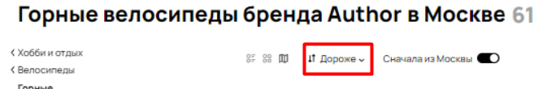

## Баги со скриншота

1. Содержание кнопки "Все категории".
**Приоритет: low**

На данный момент слово "категории" обрезано. Необходимо добавить последнюю букву "и".

2. Хлебные крошки.
**Приоритет: high**

На данный момент некорректно отображаются хлебные крошки на странице. Необходимо добавить последнюю подкатегорию товаров - горные. 

В микроразметку страницы необходимо добавит следующие строки:

< li itemprop="itemListElement" itemscope itemtype="https://schema.org/ListItem">

< a href="/***релеватный URL***/" title="Горные" itemprop="item">

< span itemprop="name"> Горные 

< meta itemprop="position" content="4">
< /a>< /li>

*Пример проверки результатов (https://search.google.com/test/rich-results/result/r%2Fbreadcrumbs?id=co5OaJr__aqUTiuR9AaOvQ&hl=ru)

3.Фильтрация товаров по цене.
**Приоритет: high**

На данный момент на скриншоте представлена фильтрация товаров от дорогих к дешевым.

При этом порядок товаров не соответствует указанному фильтру.

Необходимо изменить фильтрацию товаров для корректного порядка размещения. Настроить показ объявлений в данном случае от самого дорогого товара к самому дешевому.

4. Вид отображения товаров на странице.
**Приоритет: high**

На скриншоте выбран тип отображения товаров "на карте".

При этом товары отображаются по типу "три в ряд".
Отображение товаров "на карте" выглядит следующим образом:

Необходимо изменить тип отображения товаров при выборе в меню.

5. Количество объявлений
**Приоритет: medium**

На скриншоте нарушена связь в отображении количества объявлений.

Необходимо связать три показателя с актуальным количеством объявлений в категории.
Также необходимо проверить настройку отображения количества страниц пагинации.

6. Релевантность объявлений выбранным фильтрам
**Приоритет: high**

На скриншоте выбрана фильтрация товаров по бренду *Author*. При этом среди объявлений отображается также товар другого бренда *Atom*.

Данные велосипеды относятся к разным брендам. Пример другого вело-магазина:

Необходимо изменить фильтрацию и проверить присваивание бренда к объявлению.

7. Отображение ГЕО в объявлениях
**Приоритет: medium**

На скриншоте присутствует объявление с указанным ГЕО - Липецк. При этом в фильтрации проставлено отображение объявлений "Сначала из Москвы". При этом указанная улица в объявление располагается в Москве, в Липецке данной улицы нет. Необходимо проверить настройку объявлений при указании релевантного ГЕО и привязки адреса.

Также, необходимо сделать проверку на указание корректного адреса и станций метро, чтобы пользователи могли четко понимать расположение продавца.
Пример ошибки: 

Корректный адрес:

8. Сообщение о неисправности.
**Приоритет: medium**

На данный момент на странице отображается блок с информацией о неисправности на сайте:

 

Необходимо удалить отображение объявления на корректно работающей странице, чтобы избежать недоверия пользователей к сайту.

9. Время в объявлениях
**Приоритет: medium**

В дополнение к *пункту 7* необходимо добавить проверку на время пути к указанному адресу в объявлениях. На данный момент есть некорректный расчет.

10. Отображение цены в объявлении
**Приоритет: medium**

На данный момент на скриншоте присутствуют объявления без указанной цены.

Необходимо либо разместить обязательное условие для указание минимальной стоимости товара. Либо перенести данный товар в конце списка, так как иначе он противоречит выбранному фильтру *сначала дороже*. Отображение подобных объявлений нарушает ТОП выдачи объявлений на странице, из-за чего настройка продвижения объявления перестает быть эффективной и корректной. 